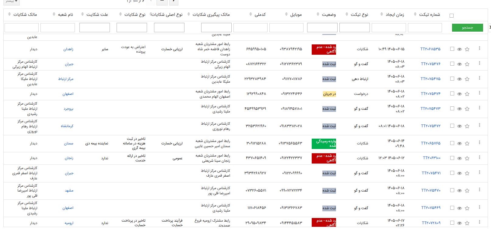
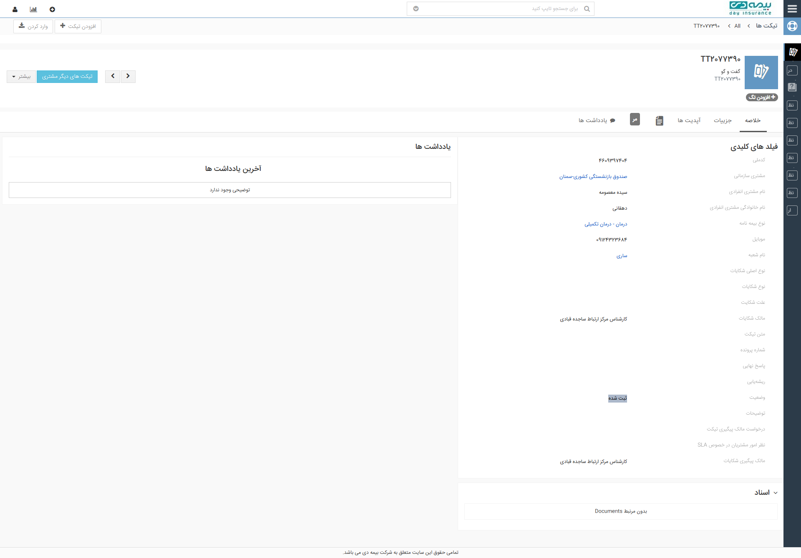
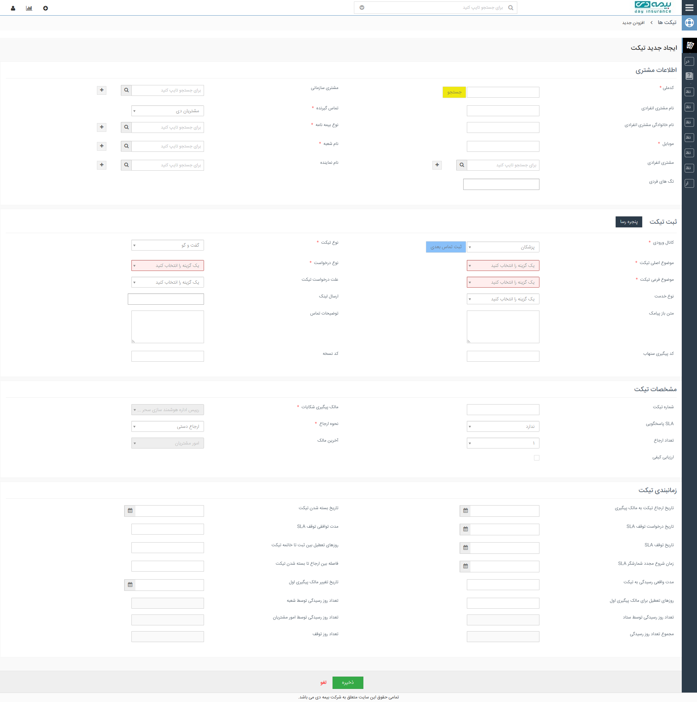
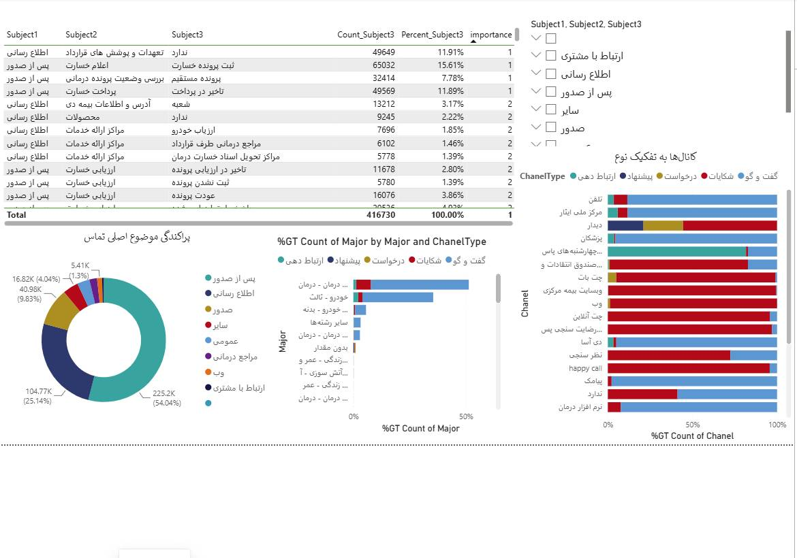
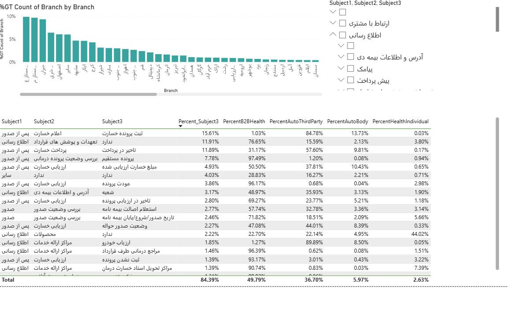

# SMART — داشبورد پشتیبانی هوشمند بیمه دی

SMART یک داشبورد پشتیبانی هوشمند برای **بیمه دی** است که اطلاعات و فرآیندهای پشتیبانی مشتری را در یک محیط واحد (Workspace) یکپارچه می‌کند. توسعه فرانت‌اند با **React + TypeScript** برنامه‌ریزی شده است.

> ⚠️ این سند نیازمندی‌ها و طرح پیاده‌سازی را توصیف می‌کند؛ پیاده‌سازی هنوز کامل نشده است.

## 🎯 هدف پروژه

- یکپارچه‌سازی اطلاعات پشتیبانی مشتری از چند سامانه در یک داشبورد واحد
- دسترسی سریع اپراتورها به اطلاعات کامل مشتری (Customer 360)
- تحلیل هوشمند تماس‌ها و تیکت‌ها و پایش KPIهای پشتیبانی

## 🔗 یکپارچه‌سازی‌های اصلی (Integrations)

| سامانه | نقش در SMART |
|---|---|
| **CRM** | اطلاعات مشتری و تعاملات |
| **Core Insurance Systems** | اطلاعات بیمه‌نامه، خسارت و داده‌های بیمه‌ای |
| **Call Center (سیتاک)** | دریافت و مدیریت اطلاعات تماس |
| **Voices** | فایل و سوابق مکالمات صوتی |
| **AI Services** | تحلیل احساسات (Sentiment)، تشخیص موضوع، برچسب‌گذاری خودکار (Auto Tagging) |

## 👥 نقش‌های کاربری (RBAC)

| نقش | مسئولیت اصلی |
|---|---|
| **Agent** | پاسخ به تماس، مشاهده اطلاعات مشتری، ثبت و پیگیری تیکت، استفاده از پیشنهادهای AI |
| **Supervisor** | مانیتورینگ اپراتورها، مدیریت صف، بررسی SLA، کنترل کیفیت و گزارش‌گیری |
| **Admin / Manager** | مدیریت کاربران، دسترسی‌ها، Scenario و Ruleها، گزارش‌های کلان و تنظیمات سیستم |

دسترسی هر نقش بر اساس **RBAC (Role-Based Access Control)** مدیریت می‌شود؛ مثلاً گزارش‌ها و Analytics فقط برای Supervisor و Admin قابل مشاهده است.

## 🧭 ساختار Sidebar و صفحات

```
├── داشبورد            (شامل Analytics و گزارش‌ها — صفحه جداگانه‌ای برای گزارش‌ها وجود ندارد)
├── تیکت‌ها
│   └── جزئیات تیکت
├── تماس‌ها
├── مشتریان
│   └── پروفایل مشتری
└── مدیریت
    ├── کاربران
    ├── دسترسی‌ها
    └── تنظیمات
```

## 📊 داشبورد اصلی

داشبورد دو لایه اصلی دارد:

1. **عملکرد اپراتورها (Operators):** تعداد تماس و تیکت هر اپراتور، زمان پاسخ و زمان رسیدگی
2. **تماس‌ها (Calls):** تعداد تماس‌های ورودی، جاری و پاسخ‌داده‌شده، ساعات پرترافیک

### منبع داده KPIها

**جدول تیکت‌ها (Ticket Table)** منبع اصلی محاسبه KPIهای داشبورد است (وضعیت تیکت‌های باز، در حال بررسی و بسته‌شده، نرخ حل و ...).

### نمودارهای تعاملی

- نمودارها دارای **فیلتر زمانی** و سایر فیلترها هستند
- امکان **کلیک برای فیلتر (Click-to-Filter)** و **بررسی جزئیات (Drill-down)** روی نمودارها
- **گزارش‌ها و Analytics داخل داشبورد اصلی ادغام شده‌اند** و صفحه جداگانه‌ای ندارند

### KPIهای کلیدی

- **FCR (First Call Resolution):** نرخ حل مشکل در اولین تماس
- توزیع و روند **کانال‌های ارتباطی** (تماس تلفنی، Ticket، درخواست، شکایت، پیشنهاد)
- **تحلیل احساسات (Sentiment)** مشتریان
- **Heatmap** تراکم تماس‌ها بر اساس روز و ساعت
- **نرخ تکرار تماس (Repeat Calls):** تعداد تماس‌های هر مشتری تا حل مشکل و زمان حل

## 🎫 لیست تیکت‌ها

ستون‌های اصلی: شماره تیکت، مشتری، موضوع، اولویت، وضعیت، اپراتور، تاریخ — همراه با جستجو، فیلتر (وضعیت، اولویت، موضوع، اپراتور، تاریخ) و مرتب‌سازی.

## 📞 تماس ورودی و دسته‌بندی

- **Popup تماس ورودی:** هنگام دریافت تماس، پنجره‌ای با اطلاعات تماس‌گیرنده نمایش داده می‌شود
- **دسته‌بندی سه‌سطحی (3-Level Categorization):** موضوع تماس در سه سطح دسته‌بندی می‌شود
- هر تماس شامل **فایل صوتی (Voice)** و **متن پیاده‌شده (Transcript)** است

## 🗂 صفحات اصلی

| صفحه | محتوای اصلی |
|---|---|
| **جزئیات تیکت** | فایل صوتی تماس، اطلاعات مشتری، اطلاعات بیمه‌ای، تحلیل AI (Sentiment، Auto Label، Priority، Suggested Scenario)، تاریخچه و مکالمه |
| **تماس‌ها** | لیست تماس‌ها (تماس‌گیرنده، زمان، مدت، وضعیت، موضوع) + فایل صوتی و تحلیل AI |
| **پروفایل مشتری (Customer 360)** | اطلاعات هویتی، سوابق تعاملات (تماس، تیکت، شکایت)، سوابق بیمه‌ای و خسارت، سابقه تحلیل احساسات |
| **مدیریت سیستم** | کاربران، Role و Permission، تنظیمات و Integrationها (فقط Admin) |

## 🎫 صفحه‌های تیکت بر اساس CRM فعلی (مرجع)

در این بخش وضعیت **فعلی صفحه‌های تیکت در CRM بیمه دی** به‌عنوان مرجع (Reference) مستند شده تا صفحه‌های تیکت SMART دقیقاً بر همین اساس ساخته شوند. برچسب‌های فیلدها عیناً از CRM فعلی برداشته شده‌اند (شامل برخی غلط‌های تایپی موجود در خود CRM).

### ۱) صفحه لیست تیکت‌ها (بر اساس CRM فعلی)





- تیکت‌ها در جدول بر اساس **TicketID یکتا** شناسایی می‌شوند؛ **کلیک روی هر ردیف، صفحه جزئیات همان تیکت را باز می‌کند** (`/tickets/:ticketId`).
- **ستون‌های جدول (به ترتیب از راست به چپ، مطابق CRM):**

| # | ستون |
|---|---|
| ۱ | چک‌باکس انتخاب |
| ۲ | شماره تیکت |
| ۳ | زمان ایجاد |
| ۴ | نوع تیکت |
| ۵ | وضعیت |
| ۶ | موبایل |
| ۷ | کدملی |
| ۸ | نوع اصلی شکایت |
| ۹ | نوع شکایت |
| ۱۰ | مالک پیگیری |
| ۱۱ | علت شکایت |
| ۱۲ | نام شعبه |
| ۱۳ | مالک شکایت |

- **نوار فیلتر بالای جدول:**
  - جستجوی متنی برای هر ستون (مثلاً کدملی، موبایل، شماره تیکت) + دکمه «جستجو»
  - صفحه‌بندی (Pagination — مثلاً ۱۰۰ ردیف در هر صفحه)
  - مرتب‌سازی ستونی (Column Sorting)
  - اکشن‌های هر ردیف: **مشاهده**، **ستاره‌دار کردن**، **منوی بیشتر (More)**
- **نمایش وضعیت به‌صورت Badge رنگی:**

| وضعیت (برچسب فعلی CRM) | رنگ Badge |
|---|---|
| «در هفته - عدم آکاهی» | 🔴 قرمز |
| «دربخواب» / «درجریان» | 🟡 زرد |
| «تثبت شده» / «بسته شده» | ⚪ خاکستری |
| «واردرمیسیگی شده» / «در رسیدگی» | 🟢 سبز |

> 💡 نکته: نام دقیق وضعیت‌ها از CRM فعلی برداشته شده است. در SMART **همان معنا** ولی با **برچسب‌های تمیزتر** نمایش داده می‌شود (مثلاً «در بررسی»، «در جریان»، «بسته‌شده»، «ارجاع‌شده»).

### ۲) صفحه جزئیات تیکت (بر اساس CRM فعلی)





- **هدر صفحه:**
  - شماره تیکت + نوع تیکت (در CRM فعلی: «کفت و گو»)
  - دکمه‌های ناوبری بین تیکت‌ها (تیکت قبلی / بعدی)
  - دکمه «تیکت‌های دیگر این مشتری»
  - بج «+ اپراتورک»
- **تب‌ها:** خلاصه • جریان‌ها (Timeline) • آپدیت‌ها • بداداشت‌ها (یادداشت‌ها)
- **پنل «فیلد‌های کلیدی»:**

| فیلد |
|---|
| کدملی |
| مشتری سازمانی |
| نام مشتری سازمانی |
| جنسیت |
| نوع بسته نامه |
| موبایل |
| نام قطعه |
| نوع اصلی شکایت |
| نوع شکایت |
| علت شکایت |
| مالک شکایت |
| متن شکایت |
| شماره بولت/پلیت |
| پاسخ نهایی |
| وضعیت |
| توضیحات |
| درخواست مالک پیگیری تیکت |
| نظر أمو مشترلین در خصوص SLA |
| مالک پیشتی شکایت |

- **بخش اسناد (Documents)** و **بخش بداداشت‌ها** (آخرین بداداشت‌ها + افزودن یادداشت)

> 💡 **تفاوت SMART با CRM:** صفحه جزئیات تیکت در SMART علاوه بر فیلدهای بالا، موارد زیر را هم نمایش می‌دهد:
> - **Voice:** فایل صوتی مکالمه + VoiceID
> - **Transcript:** متن پیاده‌شده مکالمه
> - **Sentiment:** تحلیل احساسات
> - **AI Tags:** برچسب‌های خودکار
> - **Priority:** اولویت

### ۳) ایجاد تیکت (فقط مرجع — در SMART وجود ندارد)




> ⚠️ **نکته مهم و صریح:** قابلیت «ایجاد تیکت» در SMART **وجود ندارد**؛ تیکت‌ها از CRM دریافت می‌شوند. فرم زیر صرفاً به‌عنوان **مرجع فیلدهای داده (Data Model Reference)** آورده شده تا ساختار داده تیکت در SMART با CRM هم‌خوان (Consistent) باشد.

**الف) اطلاعات مشتری**

| فیلد | اجباری |
|---|---|
| کدملی (+ دکمه استعلام/جستجوی شخص) | ✅ |
| نام مشتری سازمانی | — |
| نام مشتری فردی | — |
| تابع عضو گزیده | — |
| موبایل | ✅ |
| نام قطعه | — |
| قطعه سازمانی | — |
| نام نماینده | — |
| تک‌های هویتی | — |

**ب) ثبت تیکت**

| فیلد | اجباری |
|---|---|
| کانال ورودی (مثلاً «تماس تلفنی - بهدین») | ✅ |
| موضوع اصلی تیکت | ✅ |
| موضوع فرعی تیکت | ✅ |
| نوع درخواست | ✅ |
| علت درخواست | — |
| نوع خدمت | — |
| علت درخواست‌ایت | — |
| ارسال لینگ | — |
| توضیحات عاملی | — |
| کد پیگیری | — |
| کد نسخه | — |

**ج) مشخصات تیکت**

شماره تیکت • SLA باقی‌مانده (روز) • نوع‌هواهای (روز) • نوع‌ها • تعداد ارجاع • آخرین مالک (اپراتور) • ارباب‌کش

**د) زمانبندی تیکت** (فیلدهای SLA و زمان‌بندی در CRM فعلی)

تاریخ ارجاع تیکت به مالک بعدی • تاریخ درخواست توقف SLA • SLA باقی‌مانده (روز کاری) • زمان موجد شدند • تاریخ توقف SLA • تاریخ توقف موجد • مدت توقف/بررسی‌گی • فاصله ارجاع • روزهای تعطیل بین بسته شدن تا توقف تیکت • مدت وفقسی برسی‌گژی به تیکت • تاریخ تعیین مالک بعدی اول • تعداد روزهای تعطیل برای مالک بعدی اول • تعداد روزهای تعطیل ارباب شده • تعداد روز تعطیل ارباب مضر مشترلین • مصروع تعداد روز رسی‌گی

- **دکمه‌های فرم:** ذخیره • لغو

### ۴) نکته پیاده‌سازی SMART

- **TicketID** کلید یکتای تیکت است و همان مرجع در URL صفحه جزئیات استفاده می‌شود (مثلاً `/tickets/:ticketId`).
- **فیلدهای CRM نقش Source of Truth را دارند؛** فیلدهای SMART (Sentiment، AI Tags، Priority، Voice، Transcript) به‌صورت **فیلدهای الحاقی (Enrichment)** به همان TicketID وصل می‌شوند — هیچ داده‌ای جایگزین داده CRM نمی‌شود.
- **ستون‌های جدول تیکت SMART = ستون‌های CRM + ستون‌های الحاقی** (Sentiment Badge، AI Tags، Priority).
- **فیلتر / Sort / خروجی Excel (Export)** روی همه ستون‌ها (اعم از فیلدهای CRM و الحاقی) فعال باشد.

---


## 📊 مرجع گزارش Power BI فعلی (Analysis Reports)

گزارش فعلی **Power BI (Analysis Reports)** بیمه دی به‌عنوان مرجع بصری و محتوایی برای بخش Analytics داشبورد SMART مستند شده است. رفتار تعاملی و ساختار نمودارهای SMART باید مطابق همین گزارش باشد.




### منبع داده و ساختار فعلی

- گزارش فعلی روی دیتای تماس‌ها/تیکت‌ها ساخته شده (کل **416,730 رکورد** در نمونه).
- ساختار طبقه‌بندی موضوعی **سه‌سطحی:**
  - **Subject1** (موضوع اصلی: اطلاع رسانی، پس از صدور، صدور، اعتراض با مشتری، ارتباط دهی، سایر...)
  - **Subject2** (حمل و نقل، اغلام حملات، اطلاعاتنامه خودرو، مواراک رائه خدمات، احرای حملات و...)
  - **Subject3** (ندارد، ثبت پودنده خسارت، پوردری مستقیم، تاکیدی در مبنیت، تعداد، خریدار...)
- جدول با ستون‌های **Count_Subject3** و **Percent_Subject3** و ستون **Importance** (اولویت ۱ و ۲ برای رنگ‌بندی/مرتب‌سازی).
- تفکیک بر اساس **نوع بیمه/رشته:** PercentB2BHealth، PercentAutoThirdParty، PercentAutoBody، PercentHealthIndividual — مثلاً «ثبت پودنده خسارت حملات» **15.61%** از کل با **84.78%** سهم بیمه ثالث.
- تفکیک بر اساس **کانال تماس (CanaalType/Chanel):** ارتباط دهی، پیشنهاد، درخواست، شکایت، گفت و گو — نمایش به صورت **Stacked Bar 100%**.
- تفکیک بر اساس **Major** (رسانه، خودرو، خدمات، درمان، آتش سوزی، درمان-درمان، ...).
- تفکیک بر اساس **Branch** (شعب: مشهد، تهران، ... به صورت %GT نزولی — توزیع تماس‌ها بین شعب).

### نمودارهای صفحه اول


1. **Donut «پراکندگی موضوع اصلی تماس»:** سهم هر Major از کل — پس از صدور **54%**، ارتباط با مشتری **25.14%**، اطلاع رسانی **9.83%**، صدور **4.04%** و ...
2. **Stacked Bar «%GT Count of Major by Major and CanaalType»:** هر Major شکسته به کانال‌ها.
3. **Stacked Bar «%GT Count of Chanel by Chanel»:** هر کانال (وب، تلفن، happy call، پنل، نمایگاه، بیمه سلامت شبکه پرس، وسیله نقلیه موتوری، جت نابت، ثبت آنلاین، سامانه کشف، سفارشات و انتقادات و...) به تفکیک ChanelType.
4. **جدول سلسله‌مراتبی Subject** با Expand/Collapse (چک‌باکس + فلش باز و بسته) و فیلتر IsImportance.

### نمودارهای صفحه دوم




5. **Column chart «%GT Count of Branch by Branch»:** توزیع درصدی تماس‌ها بین شعب، مرتب‌شده نزولی با اسکرول افقی.
6. **جدول تفصیلی درصد سهم هر Subject3** به تفکیک نوع بیمه (PercentB2BHealth و ...) با سطر Total.

### ⚡ الزام تعاملی برای SMART (مهم)

- در گزارش فعلی Power BI، **کلیک روی هر تکه از هر نمگار** (یک برش Donut، یک ستون Branch، یک سگمنت کانال) باعث **فیلتر شدن کل صفحه** و نمایش فقط دیتای مربوطه می‌شود (Cross-filtering / Click-to-Filter).
- **الزام:** در پروژه SMART همه نمودارها باید همین رفتار را داشته باشند:
  - کلیک روی هر سگمنت/ستون/برش → اعمال فیلتر روی همه نمودارها و جدول‌های همان داشبورد.
  - کلیک دوباره یا دکمه **Clear** → حذف فیلتر.
  - فیلترهای فعال به صورت **Chip** نشان داده شوند (مثلاً «کانال: تلفن ×»).
  - **Drill-down:** کلیک روی Subject1 → باز شدن Subject2 → Subject3 (مثل Expand/Collapse فعلی Power BI).
  - **Hover → Tooltip** با تعداد و درصد.
  - پیشنهاد پیاده‌سازی فرانت: state مشترک فیلتر (Context/Zustand/Redux) + Recharts/Chart.js با onClick handler؛ نمودارها sync شوند.
- این رفتار با قابلیت **Click-to-Filter** و **Drill-down** که قبلاً در بخش داشبورد SMART تعریف شد یکسان است؛ این گزارش Power BI مرجع بصری و محتوایی آن است.

---

## ⚙️ قابلیت‌های عمومی

- **جستجو، فیلتر و مرتب‌سازی** در لیست‌ها
- **خروجی Excel (Export)**
- طراحی قابل توسعه برای Integrationهای آینده (Scalability)


## 🗃 فیلدهای داده کلیدی

| حوزه | فیلدهای مهم |
|---|---|
| مشتری | نام، کد ملی، موبایل، وضعیت مشتری |
| تیکت | شماره، مشتری، موضوع، دسته‌بندی (سه‌سطحی)، اولویت، وضعیت، اپراتور، تاریخ |
| تماس | تماس‌گیرنده، زمان، مدت، وضعیت، موضوع، Voice ID، فایل صوتی، Transcript |
| تحلیل AI | Sentiment، Auto Label، Priority، Topic، Tag، Suggested Scenario |
| بیمه‌ای | بیمه‌نامه‌ها، خسارت‌ها |

---

